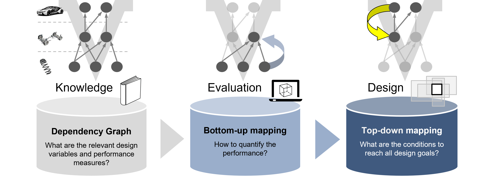
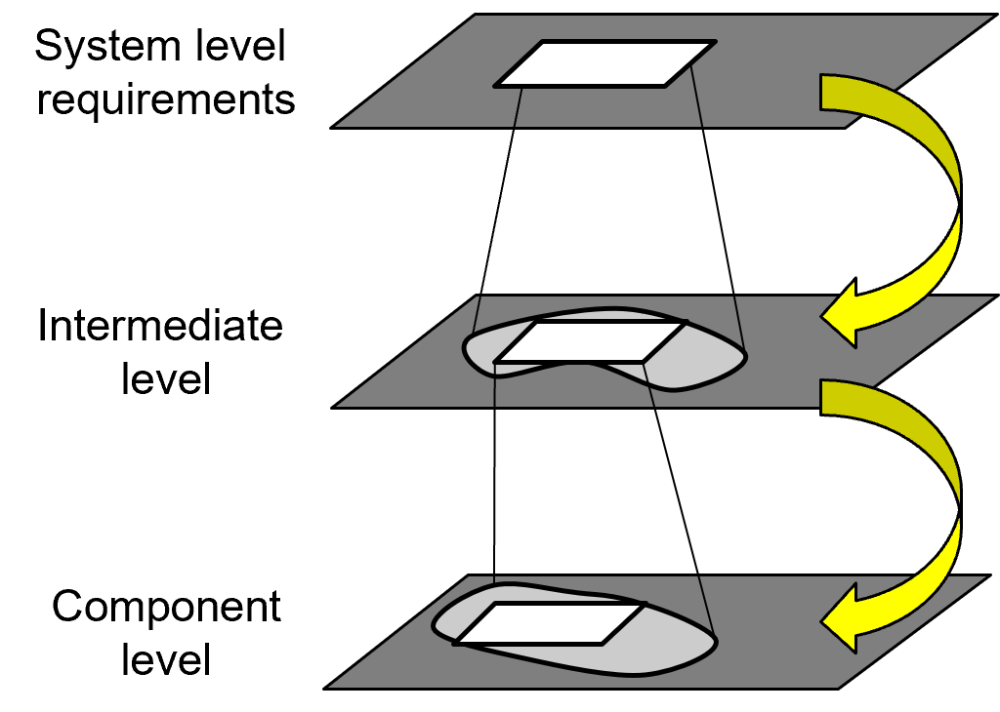
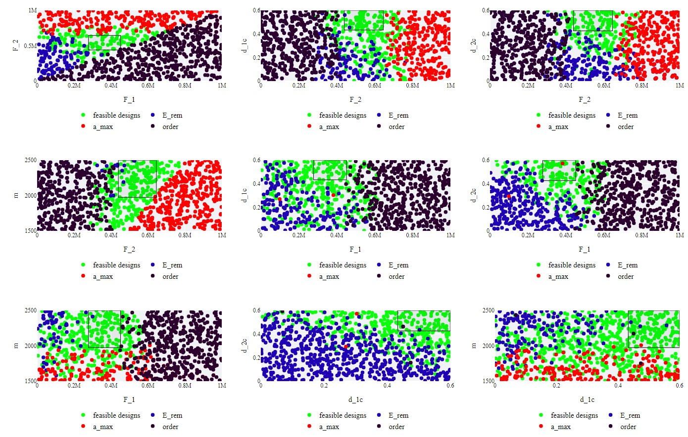

X-Ray toolbox
========

[](https://github.com/akhilsathuluri/x-ray-tool)
[](https://github.com/akhilsathuluri/x-ray-tool)
[](https://github.com/akhilsathuluri/x-ray-tool/releases)
[](https://github.com/akhilsathuluri/x-ray-tool)

<p align="center">
  
  
</p>

X-Ray toolbox is written in Python and allows users to break down the system-level requirements of a multi-component system into individual component-level requirements. This library is developed and maintained by the [Robot Systems Group, Laboratory for Product Development and Lightweight Design, TU Munich](https://www.mec.ed.tum.de/en/lpl/research/research-groups/robot-systems/). It allows users to understand and interpret the trade-offs while designing a system with several interdependent sub-systems. 



To dive more into the theory, have a look at the paper [Computing solution spaces for robust design](https://github.com/PhD-TUM/xray-python/files/7787066/file.pdf) and [On the design of large systems subject to uncertainty](https://www.tandfonline.com/doi/abs/10.1080/09544828.2017.1303664). 


## Platform
Tested with Python 3.12 on:
* Ubuntu 24.04 LTS and WSL 2.0

## Installation
* This project uses `pixi` for managing dependencies. See [pixi.sh](https://pixi.sh/latest/) website for more info. 

## Examples
Two examples are provided in [`src\problems`](https://github.com/akhilsathuluri/x-ray-tool/tree/main/src/problems) to demonstrate the working of the tool and problem setup. They are:
* [`CrashDesign`](https://github.com/akhilsathuluri/x-ray-tool/tree/main/src/problems/CrashDesign): shows decomposing requirements for a car crash problem


* [`Line`](https://github.com/akhilsathuluri/x-ray-tool/tree/main/src/problems/Line): shows setting up the problem for a dummy system 

## Usage
* The main directory to setup new problems is `xray-main/src/problems`
* Name the folder the same as the problem and define the domain for the design variables and the quantities of interest as done in [`CrashDesign`](https://github.com/akhilsathuluri/x-ray-tool/tree/main/src/problems/CrashDesign)
* The `bottom-up` mappings are defined in the `library` directory
* Define the desired design sections as an array in `plotter` within the problem definition

## Interface
* The interface is written in [streamlit](https://streamlit.io/) and can be accessed by,
```
pixi r streamlit run app.py
```
* Select the problem from the `Problem Configuration` dropdown

## Help
Use the `Getting started` dropdown on the top, present within the tool or raise an [issue](https://github.com/akhilsathuluri/x-ray-tool/issues) for help

## Citation
You can see how to use this library for the design of robots [here](https://ieeexplore.ieee.org/abstract/document/10161134)

If you use this library or find the documentation useful for your research, consider citing the work as:
```
@INPROCEEDINGS{10161134,
  author={Sathuluri, Akhil and Sureshbabu, Anand Vazhapilli and Zimmermann, Markus},
  booktitle={2023 IEEE International Conference on Robotics and Automation (ICRA)}, 
  title={Robust co-design of robots via cascaded optimisation}, 
  year={2023},
  volume={},
  number={},
  pages={11280-11286},
  doi={10.1109/ICRA48891.2023.10161134}}
```
